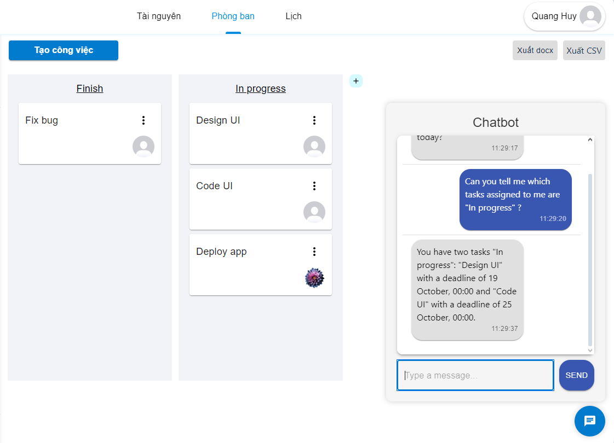
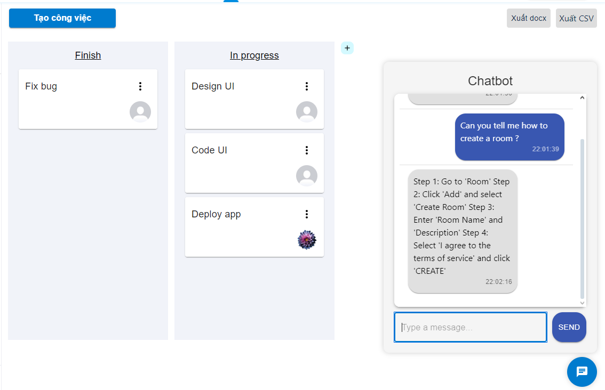
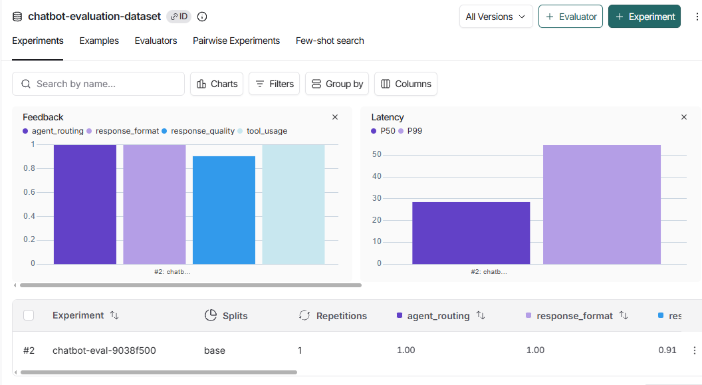

# Work Management Chatbot Backend API

This backend API powers a chatbot integrated into the [Work Management Platform](https://github.com/nmkha-github/TKPM), a group project built to help users manage tasks for their teams effectively. The chatbot assists users by answering task-related queries, helping them manage workflows, and improving productivity.

In this project, I have also provided an example of the front-end implementation for the chatbot used for experimentation. The front-end is built using React with Material-UI for styling, and it communicates with the backend through an API to fetch and respond to user queries.




## Features
- Utilized **OpenAI API** to interact with the powerful GPT generative AI model
- Supports a **multi-agent architecture**:
  - Handle task-related chat messages using **function calling**, allowing the model to access external tools like Firebase Admin SDK
  - Another agent employs **Retrieval-Augmented Generation (RAG)** to provide accurate and context-specific guidance for users.
- Built with FastAPI for a high-performance backend and integrated with a React frontend
- API endpoint to receive messages and process conversations


## Tech Stack
- **Backend**: FastAPI
- **Chatbot**: LangChain, LangGraph, OpenAI API
- **Frontend**: React (integrated separately within the work management platform)
- **API Requests**: Axios for communication between the frontend chatbot and backend
- **Database**: Firebase Cloud Firestore

## Getting Started

### Prerequisites
Ensure you have the following installed:
- Python 3.x
- FastAPI
- LangChain, LangGraph, LangSmith SDK
- OpenAI SDK
- Firebase Admin Python SDK

### Example Request

Send a POST request to the `/api/chat` endpoint with the following JSON payload:

```json
{
  "user_id":"z3QKg4lNwdi9ZySG0QfJ"
  "room_id": "WVo9e2P9zgJMQddmZzRC",
  "message": "Can you tell me which tasks assigned to me are 'In progress' ?",
  "history": [
    {"role": "model", "text": "Hello! How can I help you today?"},
  ]
}
```

### Example Response
```json
{
  "response": "You have two tasks in progress: Design UI, which is due 19 October, 00:00; and Code UI, which is due 25 October, 00:00."
}
```

## Evaluation

I have integrated **LangSmith** to provide comprehensive evaluation capabilities for the chatbot. This allows for:

- **Automatic Tracing**: Trace all LangGraph/LangChain operations.
- **Custom Evaluators**: Measure response quality, agent routing, and tool usage.
- **Test Datasets**: Manage and run test cases to ensure reliability.

To run evaluations, you can use the provided API endpoints or CLI commands.


